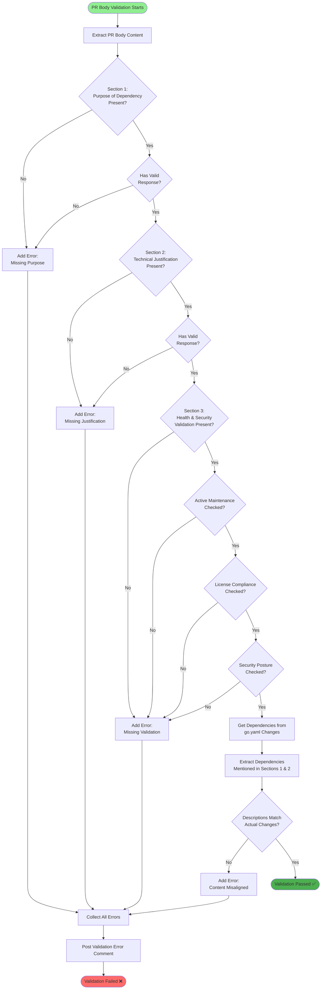
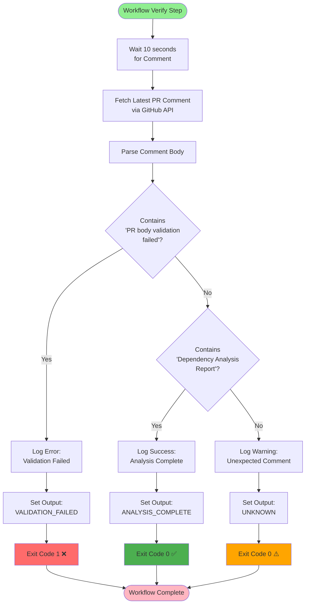

# Automated Dependency Registry Analysis - Flow Diagram

## Main Workflow Flow

```mermaid
flowchart TD
    Start([PR Created/Updated/Edited]) --> Trigger{Trigger Event?}
    Trigger -->|opened| CheckFiles
    Trigger -->|synchronize| CheckFiles
    Trigger -->|reopened| CheckFiles
    Trigger -->|edited| CheckFiles

    CheckFiles[Check if dependency-registry/go.yaml modified] --> FileCheck{File Modified?}
    FileCheck -->|No| Skip[Skip Analysis - Exit Workflow]
    FileCheck -->|Yes| ValidatePR[Validate PR Body Structure]

    ValidatePR --> CheckSections{All Sections<br/>Complete?}
    CheckSections -->|Missing Sections| PostValidationError[Post Comment:<br/>Validation Failed]
    PostValidationError --> FailWorkflow[Fail Workflow ❌]

    CheckSections -->|All Present| CheckAlignment{Content Aligns<br/>with Changes?}
    CheckAlignment -->|No Match| PostAlignmentError[Post Comment:<br/>Description Misaligned]
    PostAlignmentError --> FailWorkflow

    CheckAlignment -->|Aligned| CheckCheckboxes{All Checkboxes<br/>Checked?}
    CheckCheckboxes -->|Not All Checked| PostCheckboxError[Post Comment:<br/>Checkboxes Not Checked]
    PostCheckboxError --> FailWorkflow

    CheckCheckboxes -->|All Checked| FetchPRData[Fetch PR Data & Files]

    FetchPRData --> CompareYAML[Compare Base vs Head<br/>dependency-registry/go.yaml]

    CompareYAML --> IdentifyChanges[Identify Changes:<br/>Added/Updated/Removed]

    IdentifyChanges --> AnalyzeLoop{For Each<br/>Dependency}

    AnalyzeLoop -->|Next Dependency| FetchMetadata[Fetch Metadata<br/>from pkg.go.dev]

    FetchMetadata --> CheckLicense[Check License Type]
    CheckLicense --> VerifyLicenseCompat{Known License?}
    VerifyLicenseCompat -->|Unknown| WebSearchLicense[Web Search:<br/>Apache 2.0 Compatibility]
    VerifyLicenseCompat -->|Known| DetermineLicense[Determine Compatibility]
    WebSearchLicense --> DetermineLicense

    DetermineLicense --> CheckVulnerabilities[Check pkg.go.dev/vuln<br/>for CVEs]

    CheckVulnerabilities --> ValidateVersions[Validate Version Constraint<br/>Excludes Vulnerable Versions]

    ValidateVersions --> CheckTransitive[Fetch ALL<br/>Transitive Dependencies]

    CheckTransitive --> AnalyzeTransitive[Analyze Each Transitive<br/>Dependency for CVEs]

    AnalyzeTransitive --> CheckActivity[Check Repository Activity<br/>& Maintenance Status]

    CheckActivity --> CollectData[Collect All Data:<br/>CVEs, Licenses, Links]

    CollectData --> MoreDeps{More<br/>Dependencies?}
    MoreDeps -->|Yes| AnalyzeLoop
    MoreDeps -->|No| CalculateSummary[Calculate Security Status:<br/>Count Dependencies with Issues]

    CalculateSummary --> GenerateReport[Generate Markdown Report]

    GenerateReport --> BuildSummary[Build Summary Section:<br/>Total, Security, Licenses]

    BuildSummary --> BuildDetails[Build Detailed Analysis:<br/>Per Dependency]

    BuildDetails --> AddReferences[Add Reference Links:<br/>Repo, Docs, CVEs]

    AddReferences --> PostComment[Post Comment to PR<br/>via GitHub API]

    PostComment --> VerifyComment[Wait & Verify<br/>Comment Posted]

    VerifyComment --> CheckCommentType{Comment Type?}

    CheckCommentType -->|Validation Failed| FailWorkflow
    CheckCommentType -->|Analysis Report| PassWorkflow[Pass Workflow ✅]
    CheckCommentType -->|Unknown| WarnWorkflow[Warn - Manual Check ⚠️]

    Skip --> End([End])
    FailWorkflow --> End
    PassWorkflow --> End
    WarnWorkflow --> End

    style Start fill:#90EE90
    style End fill:#FFB6C1
    style FailWorkflow fill:#FF6B6B
    style PassWorkflow fill:#4CAF50
    style WarnWorkflow fill:#FFA500
    style PostComment fill:#64B5F6
    style AnalyzeLoop fill:#FFD54F
```



## Validation Flow (Detailed)



## Dependency Analysis Flow (Detailed)

```mermaid
flowchart TD
    Start([Analyze Single Dependency]) --> ShowEntry[Show Exact Entry Added:<br/>module, version, scopes]

    ShowEntry --> FetchPkgDev[Fetch from pkg.go.dev:<br/>Description, Latest Version]

    FetchPkgDev --> FetchLicense[Fetch License Information]

    FetchLicense --> CheckLicenseType{License Type?}
    CheckLicenseType -->|MIT, BSD, ISC, etc| Compatible[Mark: Apache 2.0 Compatible]
    CheckLicenseType -->|GPL, LGPL, AGPL| NotCompatible[Mark: ⚠️ Not Compatible]
    CheckLicenseType -->|MPL, EPL, CDDL| Review[Mark: ⚠️ Requires Review]
    CheckLicenseType -->|Unknown| WebSearch[Web Search Compatibility]
    WebSearch --> DetermineCompat[Determine Compatibility]

    Compatible --> CheckVersionStatus
    NotCompatible --> CheckVersionStatus
    Review --> CheckVersionStatus
    DetermineCompat --> CheckVersionStatus

    CheckVersionStatus[Compare Constraint<br/>vs Latest Version] --> VersionCheck{Allows<br/>Latest?}
    VersionCheck -->|Yes| VersionOK[Mark: Latest Allowed]
    VersionCheck -->|No| VersionOutdated[Mark: ⚠️ Outdated]

    VersionOK --> FetchVulnerabilities
    VersionOutdated --> FetchVulnerabilities

    FetchVulnerabilities[Fetch from pkg.go.dev/vuln] --> ParseCVEs[Parse All CVEs]

    ParseCVEs --> CheckConstraint{Version Constraint<br/>Excludes All CVEs?}
    CheckConstraint -->|Yes| CVEsSafe[Mark: CVEs Excluded]
    CheckConstraint -->|No| CVEsActive[Mark: ⚠️ Active CVEs<br/>Collect CVE Details]

    CVEsSafe --> FetchTransitive
    CVEsActive --> CollectCVELinks[Collect NVD/OSV Links<br/>for Each CVE]
    CollectCVELinks --> FetchTransitive

    FetchTransitive[Fetch ALL<br/>Transitive Dependencies] --> CountTransitive[Count Total<br/>Transitive Deps]

    CountTransitive --> LoopTransitive{For Each<br/>Transitive Dep}

    LoopTransitive -->|Next| CheckTransCVE[Check Transitive<br/>Dependency for CVEs]
    CheckTransCVE --> TransCVEStatus{Has CVEs?}
    TransCVEStatus -->|Yes| MarkTransVuln[Mark: ⚠️ Vulnerable<br/>Collect CVE Info]
    TransCVEStatus -->|No| MarkTransSafe[Mark: Secure]

    MarkTransVuln --> MoreTrans{More Transitive<br/>Dependencies?}
    MarkTransSafe --> MoreTrans
    MoreTrans -->|Yes| LoopTransitive
    MoreTrans -->|No| CalculateSecStatus

    CalculateSecStatus{Direct OR<br/>Transitive CVEs?} -->|Yes| DepHasIssues[Dependency Has<br/>Security Issues]
    CalculateSecStatus -->|No| DepSecure[Dependency Secure]

    DepHasIssues --> CollectRefs
    DepSecure --> CollectRefs

    CollectRefs[Collect All Reference Links:<br/>Repo, Docs, License, CVEs] --> BuildDepReport[Build Dependency<br/>Analysis Section]

    BuildDepReport --> End([Analysis Complete])

    style Start fill:#90EE90
    style End fill:#4CAF50
    style DepHasIssues fill:#FF6B6B
    style DepSecure fill:#4CAF50
```



## Report Generation Flow

```mermaid
flowchart TD
    Start([Generate Report]) --> CountTotal[Count Total<br/>Entries Changed]

    CountTotal --> CountAdded[Count Added]
    CountAdded --> CountUpdated[Count Updated]
    CountUpdated --> CountRemoved[Count Removed]

    CountRemoved --> CountSecIssues[Count Dependencies<br/>with Security Issues]

    CountSecIssues --> CheckSecCount{Any Security<br/>Issues?}
    CheckSecCount -->|Yes| SecStatusWarn[Security Status:<br/>⚠️ X dependencies have issues]
    CheckSecCount -->|No| SecStatusOK[Security Status:<br/>All secure]

    SecStatusWarn --> CollectLicenses
    SecStatusOK --> CollectLicenses

    CollectLicenses[Collect All Unique Licenses] --> LoopLicenses{For Each License}

    LoopLicenses -->|Next| CheckLicCompat[Check Apache 2.0<br/>Compatibility]
    CheckLicCompat --> FormatLicense[Format:<br/>License (Status)]
    FormatLicense --> MoreLicenses{More Licenses?}
    MoreLicenses -->|Yes| LoopLicenses
    MoreLicenses -->|No| BuildSummary

    BuildSummary[Build Summary Section] --> OpenDetails[Open Details Section]

    OpenDetails --> LoopDeps{For Each<br/>Dependency}

    LoopDeps -->|Next| AddDepSection[Add Dependency Section:<br/>Name & Version]
    AddDepSection --> AddEntry[Add Exact Entry Added]
    AddEntry --> AddLicense[Add License Info]
    AddLicense --> AddVersion[Add Version Status]
    AddVersion --> AddSecurity[Add Security Analysis]
    AddSecurity --> CheckCVEs{Has CVEs?}
    CheckCVEs -->|Yes| AddCVEDetails[Add CVE Details Section<br/>with Links]
    CheckCVEs -->|No| AddTransitive
    AddCVEDetails --> AddTransitive

    AddTransitive[Add Transitive Dependencies<br/>Analysis] --> AddReferences[Add References Section<br/>with All Links]

    AddReferences --> MoreDeps{More<br/>Dependencies?}
    MoreDeps -->|Yes| LoopDeps
    MoreDeps -->|No| AddNote

    AddNote[Add Warning Note] --> AddFooter[Add Footer with<br/>Timestamp & PR Info]

    AddFooter --> CloseDetails[Close Details Section]

    CloseDetails --> FormatMarkdown[Format as<br/>Clean Markdown]

    FormatMarkdown --> End([Report Ready])

    style Start fill:#90EE90
    style End fill:#4CAF50
```

## Workflow Decision Flow



## Legend

- 🟢 **Green** - Start/Success states
- 🔴 **Red** - Error/Failure states
- 🟠 **Orange** - Warning/Unknown states
- 🔵 **Blue** - Important action (e.g., posting comment)
- 🟡 **Yellow** - Loop/Iteration points
- ◇ **Diamond** - Decision points
- ▭ **Rectangle** - Process steps
- ⬭ **Rounded** - Start/End points
